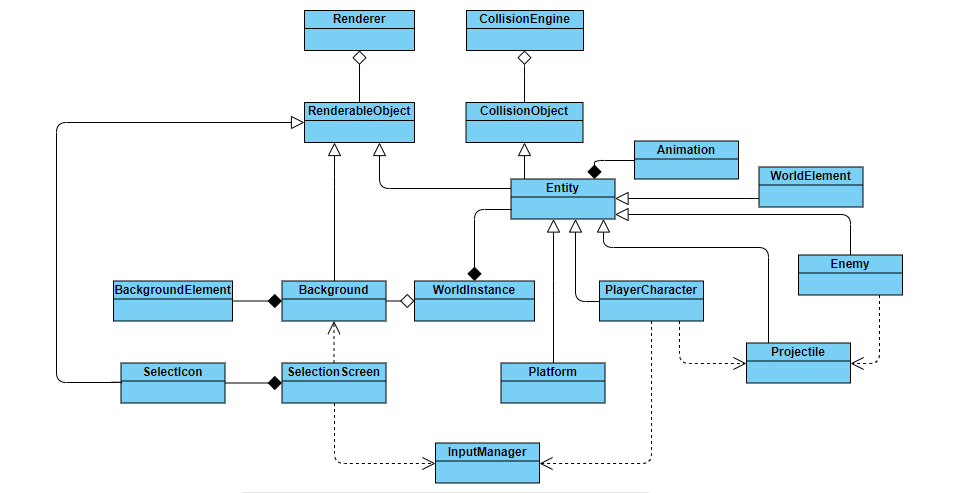

# Tiny Heroes
Decided to dive into game dev so I started from scratch with SFML. This is a basic looking 2D platformer which I'm probably going to keep on slowly upgrading as a pastime and I hope someone might find it entertaining/useful. 

##### Table of Contents  
1. [Setup](#computer-setup)  
2. [UML representation](#uml-representation)
3. [Sample](#sample)

## :computer: Setup 
The project was made on Windows using Visual Studio so I will write a detailed setup for that.

* Install SFML library by downloading the SDK from the [download page](https://www.sfml-dev.org/download.php), unpack it and copy the files to your preferred location. (or just use the one in the repository)

1. Download (clone) this repository
2. Open the solution using Visual Studio
3. Before building, you're going to have to setup SFML by right clicking on your project,selecting properties and then do the following:  
	*Note: the first 2 steps are for all configurations*
	* C/C++ -> General -> Additional Include Directories: Add the path to your sfml\include directory
	* Linker -> General -> Additional Library Directories: Add the path to your sfml\lib directory
	* Linker -> Input -> Additional Dependencies: Here you are going to add 5 sfml *.lib files for both release and debug configurations. The files are:  
		sfml-system.lib  
		sfml-graphics.lib  
		sfml-audio.lib  
		sfml-network.lib  
		sfml-window.lib  
For the debug version just add -d (e.g. sfml-system-d.lib).  
*Note: You don't need all 5 for this particular project.*
4. Build the solution.
5. If you get an error saying "sfml-system-d-2.dll is missing", just copy all *-d-2.dll files from your sfml\bin directory and paste them to the projects Debug folder.
6. Run the program.
7. Have fun! :)

## UML representation

## Sample

